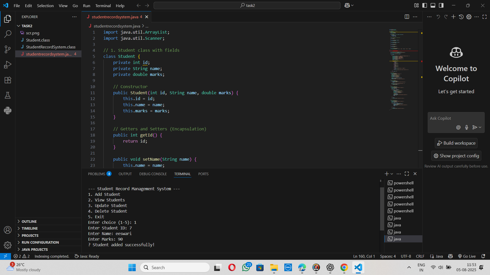

# 🎓 Student Records Console App

This is a **Java Command-Line Interface (CLI)** application designed to manage student records efficiently using **ArrayList** and core **Object-Oriented Programming (OOP)** principles.

---

## 👩‍💻 Author

**Pucchalapalli Eeswaridevi**  
🔗 GitHub Repository: [StudentRecordsConsoleApp](https://github.com/pucchalapallieeswaridevi/StudentRecordsConsoleApp/tree/main)

---

## 🧰 Tools & Technologies Used

- Java SE (JDK 17 or higher recommended)
- Visual Studio Code or IntelliJ Community Edition
- Git & GitHub
- Terminal / Command Prompt

---

## 🎯 Project Objective

To develop a simple and interactive CLI-based system for performing **CRUD (Create, Read, Update, Delete)** operations on student records.

---

## 🔑 Key Concepts Practiced

- ✅ Java Classes and Objects
- ✅ Encapsulation using private fields, getters, and setters
- ✅ Java Collections (`ArrayList`)
- ✅ Loops and Conditional Logic
- ✅ Constructor Overloading (if applied)
- ✅ CLI-based User Interaction

---

## ✅ Features

- ➕ **Add Student**  
  Add a new student with ID, Name, and Marks.

- 📄 **View All Students**  
  Display a list of all students.

- 🔁 **Update Student**  
  Update a student’s name or marks using their ID.

- ❌ **Delete Student**  
  Remove a student record by ID.

- 🚪 **Exit**  
  Gracefully terminate the application.

---




## ▶️ How to Run the Program

1. **Clone or Download the Repository**

```bash
git clone https://github.com/pucchalapallieeswaridevi/StudentRecordsConsoleApp.git
cd StudentRecordsConsoleApp

